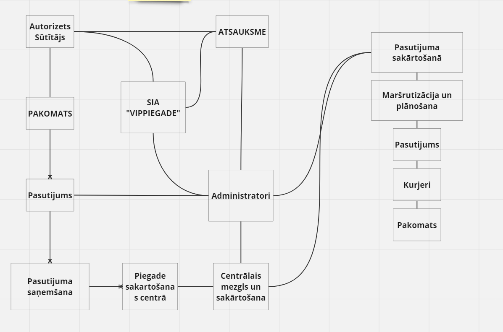
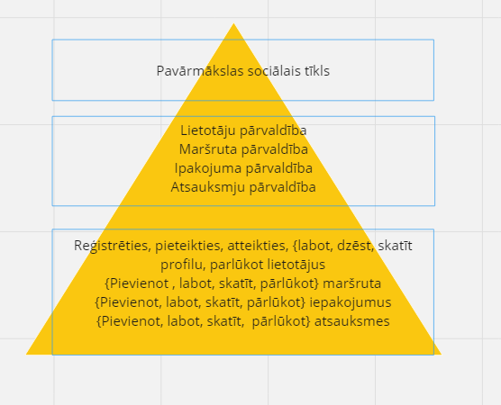

# basketbols-ar-kaju

NBA game outcome prediction.

### Saturs

- [Technology stack](#Technology-stack)
- [Concept](#Concept)
- [Lietotāju stāsti](#Lietotāju-stāsti)

# Tehnoloģiju steks

| Servera puse |  |
| --- | ----------- |
| Satvars | Flask |
| Programmēšanas valoda | Python |
| Datu bāze | SQLLite |
| OS | Windows |
| Serveris | Izstrādātāja dators / Azure |

## Concept

## Lietotāju stāsti

| Apraksts                                                                                                                                                              | Prioritāte (1..10) |
| --------------------------------------------------------------------------------------------------------------------------------------------------------------------- |:------------------:|
| Kurjers vēlas prognozēt maršrutu, jo jāminimize laiku.                                                                                                                |         10         |
| Kurjers vēlas saņemt savlaicīgu ziņojumu no klienta, kas caur administrāciju informē par sūtījuma sūtīšanas atcelšanu, sniedzot skaidras norādes.                     |         8          |
| Lietotājs vēlas norēķināties par piegādi ar karti, lai atvieglotu apmaksu.                                                                                            |         5          |
| Lietotājs vēlas saņemt prognozēto piegādes datumu, jo jāparliecinās, ka piegāde būs laika.                                                                            |         6          |
| Saņēmējs vēlas saņemt SMS ziņojumu par sūtījuma ierašanos pieņemšanas vietā.                                                                                          |         5          |
| Administrators vēlas saņemt atsauksmi , jo jāuzlabo programmu.                                                                                                        |         4          |
